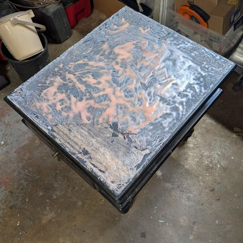
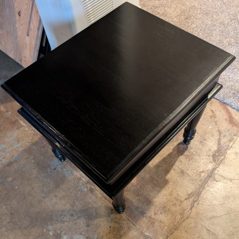

#+TITLE: Journal for the week of Dec 27th 2025
#+AUTHOR: Ben
#+DATE: 2025-12-27
#+TAGS: journal

* End Table Project
Refinishing an end table we picked up off the corner. It's in good shape, but the paint on the top was cracked and peeling. I did a could of rounds of paint stripper and then did a round of mineral spirits to prep the surface. I plan to paint it this week and give it to my buddy for his new place.

It's strange, refinishing the surface of the table will make it look better but at the same time will make it look like any other random piece of mass-produced furniture. I'm not sure how to feel about that. Instead of spending time refinishing the surface, I could've bought a new end table in a similar style. What is the difference? Why do I feel that doing work is better than spending money? I already did the work to get the money, why does it matter?

Spending your time for someone is a way to show them you care. I'm a way that spending money doesn't, even though you spent time to get that money. Why does the indirection make it feel different? Is it too much for our primitive wiring?

 

* Car Maintenance
The windshield washer sprayer on Andrea's car has been acting up so I replaced it. We tried making our own windshield washer fluid using Castile soap (internet recipe) and I think it was the source of the issue. A new pump was only $20 so I thought it would be a cheap to test that theory. The replacement worked and only took ~30 minutes to replace.

I also bought wheel ramps for changing the oil on the new Civic and I used them here which made the job much easier. I had to buy "low profile" wheel ramps because the bumper is so low, but they've worked out great so far.

I've been doing the maintenance on my cars for a long time now, though I'm not sure why I continue to do it. I think it's a combination of the "coordination tax" and being fussy about the way it's going to be done.

Coordination tax is the extra effort you have to make to get something done that requires talking to someone else. In this case it would be finding a mechanic, scheduling a time to bring in the car, dropping it off and picking it back up. Plus you lose the use of the car while it's at the mechanics. This is a common theme in my life and often why I prefer doing my own maintenance. It's hard to evaluate professional services beforehand and they're often expensive.

In this example I probably would've spent more than 30 minutes just getting the mechanic coordinated and it would've cost at least 5X the cost of doing it myself (1 hour of shop time $60, part cost $40).  So in this case it doesn't save me any time or money to take it into the shop, or at least that's my thinking.

* Tech Book Group
My book group just started reading "Vibe Coding" by Gene Kim & Steve Yegge. In the first part of the book there's an anecdote about how surgeons preferred using surgical robots instead of junior surgeons to assist them with surgeries. Another example of the Coordination tax. Maybe this will happen more and more as AI becomes more prevalent in programming. Surgeons are still doing surgeries, so I believe programmers will still do programming in this new world. I believe AI will have a Jevon's Paradox effect on software, ergo as programming becomes easier/more effective more companies will want to write software.

I think it's easy to look at the current state of software and feel like we have more software than we know what to do with, but I'm sure there are many companies that could benefit from custom software or software that has some marginal value that is currently too low to make it worth writing.

So far the book has been hot and heavy on vibe coding and agentic coding with little discussions of the downsides or cases where it's not effective, but I think the later chapters will discuss pitfalls and downsides. Having read many blog posts by Steve Yegge, this book matches his tone. Steve's blog posts are often polemics, having a strong opinion, sometimes outside the mainstream. Being a reformed misanthrope I enjoy reading this style of debate. This goes along with doing most of my own maintenance. Maybe I think I'm smarter than I really am :)
